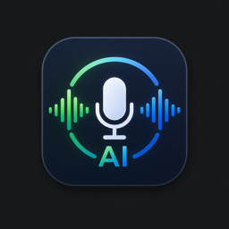

# AI Record

<p align="center"></p>

   

**AI Record** is a local, open-source **meeting scribe & voice-to-text** app for Windows.
During any online meeting (Teams/Zoom/Meet…) — or as a standalone **dictation** tool — it
captures your system audio (WASAPI loopback) and microphone, transcribes it in real time
with **faster-whisper** on the GPU, **translates** foreign speech to Vietnamese, **separates
speakers**, and runs AI **Summary** & **Analyze** actions with a **local Qwen 2.5-7B model
(via Ollama) by default** — private and offline. You can switch the provider to Claude CLI /
Codex CLI / Gemini in Settings.

**100% local & private** — audio never leaves your machine. With the default local Qwen
summarizer, even the AI actions stay on-device; only if you switch to a cloud provider does
transcript *text* leave the machine. Outputs are your choice: `.md` (default), `.txt`, `.mp3`,
and an AI summary.

**AI actions (three tabs in the expanded view):** **Transcript** is always live in real time;
**Summary** groups ideas while keeping wording (a light reformat); **Analyze** gives a general
analysis plus critical questions/risks. Summary and Analyze run on-demand when you click the
tab — the first run loads the model (~10–20 s), then it's fast; the transcript keeps updating
in the background.

🌐 **Website:** https://ducnguyen.vn/ai-record/ · 📖 **Guide:** [`docs/guide.html`](docs/guide.html) · 📄 **Spec:** [`docs/SPEC.md`](docs/SPEC.md)

---

## ⚠️ Legal & consent (read first)

ai-record records your computer's audio output (loopback) plus your microphone.
Because it does **not** use the meeting platform's recording feature, **the
platform shows no recording indicator to other participants.** This is a
technical consequence of loopback capture — the app is listening to your speakers
like any audio app — and **not** a stealth feature.

**Recording other people without their knowledge or consent may be illegal.**
Many jurisdictions have two-party (all-party) consent laws. ai-record is intended
for personal note-taking of meetings you participate in. **You are solely
responsible** for complying with the law and, where required, obtaining consent
from and disclosing the recording to all participants.

On first run the app shows a consent modal you must acknowledge. The server
**enforces** this: `POST /api/capture/start` returns `403` until consent is
acknowledged.

---

## What M1 gives you

- **Dual WASAPI capture** (loopback + mic) behind a backend contract that reports
  the actual opened format, resamples to 16 kHz mono, and emits health telemetry.
- **Crash-safe raw audio**: rolling per-minute WAV segments + a `samples.idx`
  sidecar. A crash/power-loss loses at most ~1 minute of audio.
- **Per-source VAD segmentation** into sample-accurate utterances.
- **STT-first pipeline**: a single GPU faster-whisper worker with hallucination
  guards + an OOM/backpressure fallback ladder. Each transcript is persisted and
  broadcast immediately.
- **Durable session storage** (JSONL schema v2 + incremental `transcript.md`) in
  `<app>\records\<YYYYMMDD-HHMMSS>-<title>\`, with atomic rewrites and a per-session lock.
- **FastAPI server** on `127.0.0.1` with per-launch token auth, Origin allow-list,
  a server-side consent gate, REST control + a live WebSocket (bounded per-client
  queues, `since_seq` catch-up).
- **Desktop UI** (pywebview) with a first-run consent modal, preflight screen, and a
  **frameless window you drag by its top header** (a tap on a button still clicks) and
  **resize from any edge or corner** — a taller window shows more transcript lines, and
  clicking the logo opens the website. The compact icon bar (sized so every icon fits at
  the default width) holds a **Record** button, a **Listening** toggle (no-save mode,
  below), mic + speaker **device dropdowns** with a live green dot, a translate From→To
  popover, a **Copy** control (dropdown: text only / with speakers), the output-format
  selector, folder, settings, expand and close. The expandable view adds three tabs —
  **Transcript / Summary / Analyze** — plus search. Transcript text is **selectable**
  (highlight any lines + Ctrl+C to copy elsewhere) and a **"Văn bản ⇄ Hội thoại"** toggle
  flips the Transcript tab between the dialogue view (speaker rows) and a plain-text block.
- **Listening mode (ephemeral, no-save)**: next to **Record**, the **Listening** toggle
  records, transcribes, translates and can run Summary/Analyze **entirely in memory** — it
  writes **nothing to disk** (no session folder under `records\`, no transcript/audio/
  summary files), for quickly turning speech into text you copy elsewhere. While it's on,
  the app hides the open-folder + save-format controls and shows a **"Listening — không
  lưu"** indicator; Summary runs on the in-memory transcript.
- **Incomplete-session recovery** on startup: offline-transcribe the untranscribed
  audio tail of a session that never finalized.

---

## Install

Windows 11, Python 3.12, NVIDIA GPU with a working CUDA `torch` for real STT.

```powershell
git clone https://github.com/ducnguyen221/ai-record
cd ai-record
powershell -ExecutionPolicy Bypass -File setup.ps1              # venv + CUDA torch + deps
powershell -ExecutionPolicy Bypass -File scripts\setup-ollama.ps1   # optional: local Qwen for the AI actions
python -m ai_record                                            # or the Desktop shortcut
```

- `setup.ps1` builds the `.venv`, installs the CUDA `torch` and all dependencies.
- `scripts\setup-ollama.ps1` is **optional but needed for the Summary/Analyze tabs on the
  default (local Qwen) provider** — it installs Ollama (winget) if missing and pulls
  `qwen2.5:7b`. Skip it if you'll only use a cloud provider (Claude/Codex/Gemini) in Settings.

> Do **not** blindly reinstall `torch`/`faster-whisper` — see
> [`requirements-notes.md`](requirements-notes.md). First run downloads models
> (~4–6 GB); later runs are offline-capable.

## Run

```powershell
python -m ai_record       # or:  python main.py
```

This runs preflight, starts the localhost server on a free port (default 8848),
and opens the frameless always-on-top window at
`http://127.0.0.1:<port>?token=<per-launch-token>`. If pywebview is unavailable
the URL is printed so you can open it in a browser.

Sessions are written **inside the app folder** at
`<app>\records\<YYYYMMDD-HHMMSS>-<title>\`. Settings live in
`%LOCALAPPDATA%\ai-record\settings.json` and the runtime log at
`%LOCALAPPDATA%\ai-record\ai-record.log`; secrets (HF token, Gemini key) live in
Windows Credential Manager via `keyring`, never in the JSON.

## Settings highlights

- **Kết nối AI (per-machine sign-in).** Shows connection status for each provider —
  **Claude CLI / Codex CLI / Gemini / Ollama** — with **Đăng nhập** (launches that CLI's
  own login on this machine) and **Kiểm tra** (test) buttons. **The app embeds no
  credentials and never stores, reads or shares them:** each machine connects with its
  own account — the app just invokes the local `claude`/`codex` CLI (which holds its own
  login), Gemini uses a key in the OS keychain, and Ollama is fully offline. Installing
  the app on another machine leaks nothing from this one.
- **Prompt AI (Summary / Analyze).** Two editable text areas — the reformat and analyze
  instructions — pre-filled with strong defaults, each with a **Khôi phục mặc định**
  reset, so you can tune how the AI summarizes and analyzes.
- **Whisper model / Compute type.** Left on the preset default, both dropdowns read
  **"Auto — theo preset (large-v3 / int8_float16)"** — the app uses the GPU preset, not a
  tiny model.

## Test

Tests run on CPU with **no GPU, no audio hardware, and no model downloads**.

```powershell
py -3.12 -m venv .venv
.\.venv\Scripts\Activate.ps1
pip install -r requirements-dev.txt
python -m pytest
```

---

## Milestones (from the spec)

- **M1 — Core recorder** *(this build)*: dual capture, crash-safe WAV, VAD, STT,
  storage, server (token/consent), preflight, live UI, recovery.
- **M2 — Live translation**: NLLB CT2 int8 (CPU) with gating/batching/staleness +
  progressive translation patches + Gemini stub.
- **M3 — Realtime diarization (Tier 1)**: online speaker clustering with confidence,
  "Speaker ?" for unknown/overflow, renameable labels, patch UI.
- **M4 — Offline enrichment**: pyannote Tier-2 re-diarization (sample-time),
  hardened Claude-CLI summarizer, delete/retention UI, expanded-UI polish.

M2–M4 features are left as clean extension points in M1 (a `patch` WS message
type exists; translation/speaker fields are present-but-null; the fallback ladder,
preset stack, and provider interfaces are already wired).

## Layout

```
ai_record/
  __main__.py     entrypoint (preflight → server thread → pywebview)
  config.py       Settings + presets + VRAM detect + keychain Secrets
  preflight.py    CUDA / model-cache / disk readiness report
  audio/          ringbuffer · capture (backend contract) · vad · segmenter
  transcriber.py  faster-whisper wrapper (guards + OOM ladder) + MockTranscriber
  store.py        WavWriter · RawSegmentWriter · SessionStore (schema 2, recovery)
  pipeline.py     capture→segment→STT(emit)→store/broadcast + fallback ladder
  server.py       FastAPI: token/Origin auth, consent gate, REST + WS
  web/            vanilla HTML/CSS/JS UI (no build, no CDN)
tests/            unit + integration (CPU-only)
docs/SPEC.md      the authoritative specification (v2.0)
docs/guide.html   standalone HTML guide (intro + usage + how-it-works + this section)
```

## Models, resource cost, privacy & risks

A friendly, self-contained version of this section (with diagrams) lives in **`docs/guide.html`** — open it in a browser.

### Models in use (reference machine: RTX 4070 12 GB)
| Role | Model | Runs on | Disk | RAM / VRAM |
|---|---|---|---|---|
| Speech→text (STT) | faster-whisper **large-v3** (int8_float16) | **GPU** | ~1.5 GB | ~2–3 GB VRAM |
| Voice activity (VAD) | Silero VAD | CPU | few MB | negligible |
| Translation | NLLB-200 **distilled-600M** (int8) | **CPU** | ~1.2 GB | ~1–2 GB RAM |
| Realtime diarization | Resemblyzer | CPU | ~15 MB | light |
| Accurate diarization | pyannote 3.1 (HF token) | GPU (on demand) | ~100 MB | post-meeting |
| Summary / Analyze | **local Qwen2.5-7B via Ollama *(default)*** / Claude CLI / Codex / Gemini | **local** / ☁️ | — | see below |

First-run model download ≈ 4–6 GB. During a meeting: ~2–3 GB VRAM (Whisper) + moderate CPU (NLLB/embeddings/VAD); near-zero while silent (VAD-gated). Audio WAV is written during capture (~2 MB/min/source) and **deleted on finalize unless you keep it** (Settings → Lưu kết quả).

### Cost — local vs cloud
**Capture · STT · translation · diarization are 100% LOCAL and FREE; audio never leaves the machine.** The on-demand **Summary** and **Analyze** actions are **local too by default**:

- **Local Qwen via Ollama (default)** — 100% local, free, offline; nothing leaves the machine. Install once with `scripts\setup-ollama.ps1`.
- **Claude CLI / Codex CLI** — sends the transcript **text** (never audio) to Anthropic/OpenAI, using your existing Code subscription (quota, not per-call cash).
- **Gemini** — text to Google, needs an API key (may cost).

Keep the default (local Qwen), or skip Summary/Analyze entirely, and the app is fully local.

### Risks
- ⚖️ **Legal/consent (biggest):** recording others without consent may be illegal (two-party-consent laws). There is no platform "recording" indicator (a consequence of loopback capture) — you must disclose/obtain consent where the law requires it.
- 🔓 **Data at rest is plaintext** under `<app>\records\` — anyone with machine access can read it. Use delete / retention.
- ☁️ **Cloud summarize** (only if you switch off the default local Qwen) sends transcript text out; transcript is treated as untrusted (prompt-injection hardened) but still leaves the machine.
- 🔑 Secrets (HF token, Gemini key) are stored in **Windows Credential Manager** (keyring), not plaintext. Local server is `127.0.0.1`-only, token + Origin gated. No kernel drivers, admin, or telemetry.

### Local summarizer model — comparison & recommendation
The **default provider is local Qwen 2.5-7B via Ollama** — private, offline, free. Install it once with `scripts\setup-ollama.ps1` (below); switch to a cloud provider any time in **Settings → Summarization**. **Ollama is a runtime, not a model** — model quality is what matters. For Vietnamese transcripts mixed with Japanese/English on a 12 GB GPU:

| Model | VRAM (Q4) | VN/Japanese | Speed (4070) | Notes |
|---|---|---|---|---|
| **Qwen2.5-7B-Instruct** ⭐ | ~5 GB | best | fast (~40–60 tok/s) | **recommended — best balance** |
| Qwen2.5-14B-Instruct | ~9 GB | excellent | medium | top quality, run post-meeting |
| SeaLLMs-v3-7B / Vistral-7B | ~5 GB | Vietnamese-tuned | fast | if almost only Vietnamese |
| Llama 3.1/3.3-8B | ~5 GB | ok (weaker VN) | fast | popular, but Qwen wins for VN |
| Gemma 2-9B | ~6 GB | ok | medium | solid |
| Phi-4-14B | ~9 GB | weak VN | medium | strong reasoning, English-centric |

**Recommendation:** `Qwen2.5-7B-Instruct` — the **default** — best multilingual for VN+Japanese, ~5 GB VRAM (fits alongside Whisper), fast, 100% local/free. Cloud (Claude/Gemini) is a bit smoother but sends text out. Install / switch model:

```powershell
powershell -ExecutionPolicy Bypass -File scripts\setup-ollama.ps1   # installs Ollama + pulls qwen2.5:7b
# already default; to change: AI Record → Settings → Summarization → Ollama model
```

To use a **cloud** provider instead, set **Settings → Summarization → provider** to
Claude CLI / Codex CLI / Gemini. (The earlier Windows bug where the Claude CLI didn't
launch is now fixed.)

### Model management (built in)
The app ships a curated catalog and tooling so you can pick a model per machine and keep it current — **default is `qwen2.5:7b`**:

- **Catalog:** `ai_record/summarizer_models.json` (single source of truth; the Ollama default is read from it). Endpoint `GET /api/models/catalog` returns `{default, models, current, installed, ollama_available}`.
- **Pick in-app:** Settings → Summarization → **Ollama model** dropdown lists the catalog (shows `✓` for models already pulled, marks the default) plus a **Custom…** field for any tag. On another machine just pick the size that fits its GPU.
- **Install / expand (any machine):**
  ```
  .\scripts\setup-ollama.ps1                 # installs Ollama (winget) if missing + pulls qwen2.5:7b
  .\scripts\setup-ollama.ps1 -Model qwen2.5:14b   # or any other tag
  ```
- **Research updates:** `python scripts\research-models.py` lists installed models, best-effort checks the Ollama registry for newer tags per family, and suggests `ollama pull` commands (degrades gracefully offline / without Ollama). For a broader survey of newly released models, ask the AI Record agent to refresh `summarizer_models.json` via web research.
